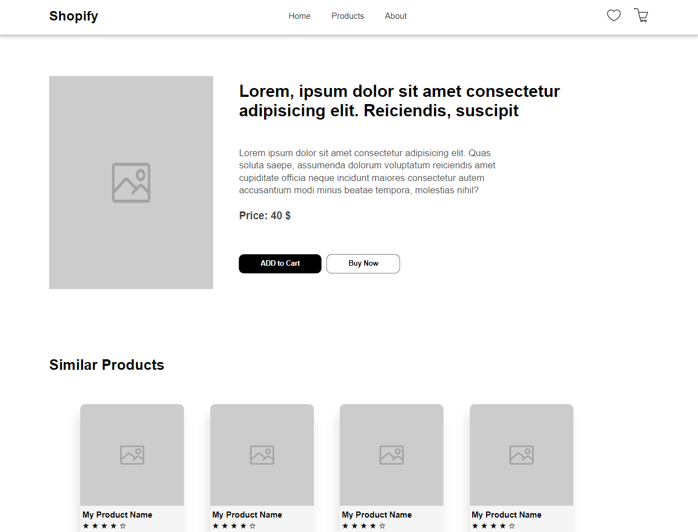

<h1>Enable Session__ Day5</h1>

<h2>Topics Covered</h2>

<ul>
    <li>async behaviour of JS</li>
    <li>API concept</li>
    <li>fetch</li>
    <li>DOM Manipulation on Ecommerce application </li>
</ul>

 
 
 

    api used: fake store api

   

